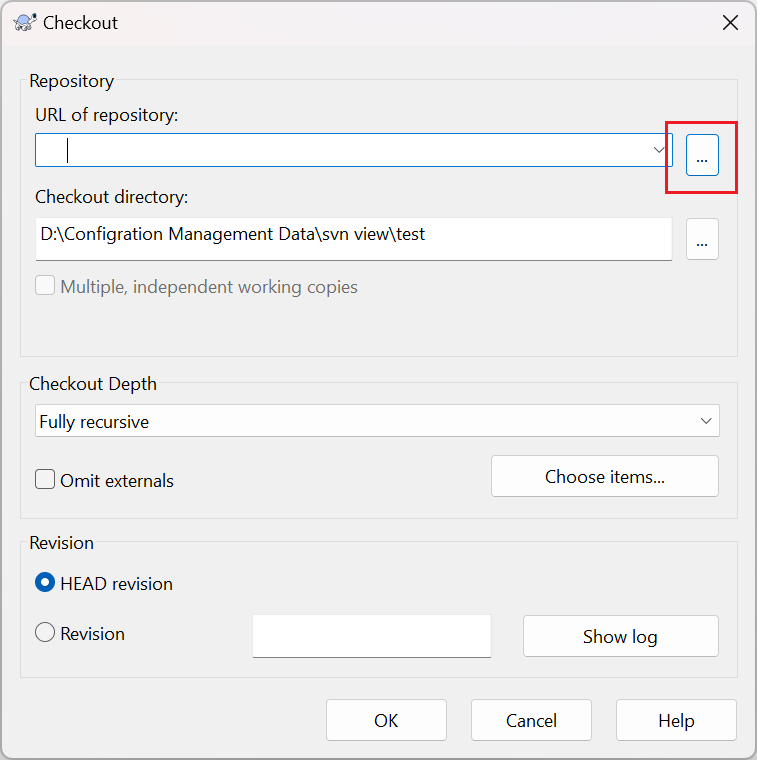
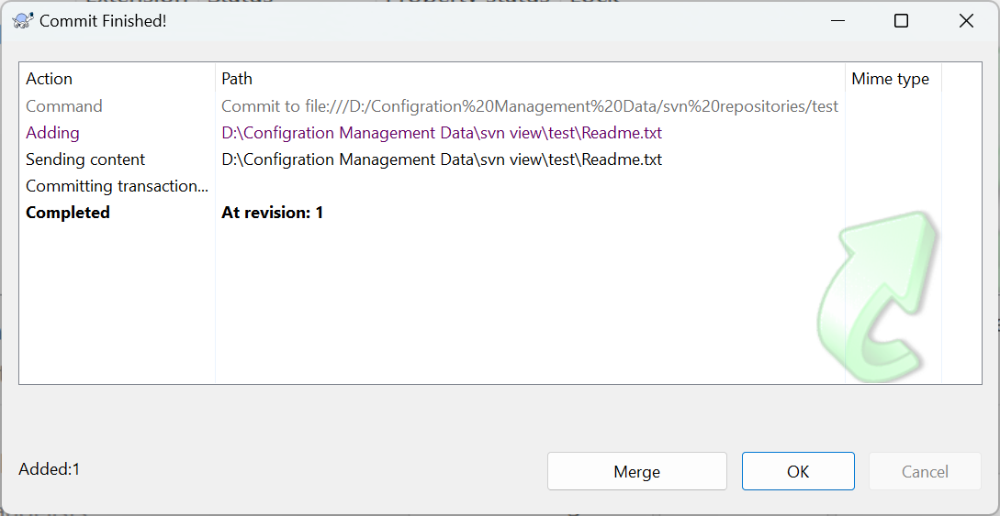

# subversion 服务器安装与管理

## Windows

### 下载 & 安装

1. 从 https://sourceforge.net/projects/tortoisesvn/ 下载 windows 安装包。

2. 双击安装包，启动 svn 安装程序

   

3. 选择安装所有可选 Feature 到本地硬盘，这可以选择一下安装的路径，默认是 C 盘，选不了就 next 后再 back 一下。

   

4. 安装过程 Windows 会提示一次是否允许 svn 安装程序访问存储，同意即可。

5. 安装过程中，会提示有哪些应用服务在运行，需要选择是否关闭并在重启电脑后启动这些程序，遇到不能关闭的程序，也会有提示。

   

   

6. 安装完成后会提示是否选择现在重启电脑，选择重启。

   

### 创建第一个 svn 仓库

1. 在 D 盘创建一个目录 “D:\Configration Management Data\svn repositories\test" （什么名字，几层结构都可以）

2. 进入这个路径，执行下面的命令：

    ```bat
    d:
    cd “D:\Configration Management Data\svn repositories\test"
    svnadmin create . 
    ```

3. 一个 svn 仓库就创建好了，我们看一下创建完成后目录的样子

   

 <a name="test"></a>
4. 测试一下新建立的仓库，创建一个 view 的目录 "D:\Configration Management Data\svn view\test"

5. 在文件管理器中进入到这个目录，右键选择 TortoiseSVN ---> Checkout：

   
 <a name="test6"></a>
6. 选择刚刚创建的 svn 仓库本地路径

   

7. OK，这时我们看到，提示 Checkout 成功了，我们看到 revision 是 0，这是我们新建立的仓库，还没有任何内容。在文件夹下也可以看到一个 .svn 的隐藏文件夹（如果看不到，请调整系统关于文件夹显示的设置）。

   

8. 我们向仓库中增加点儿内容，试一下，在文件夹下建立一个 Readme.txt 的文本文件，随便写一些内容。
<a name="test9"></a>
9. 在文件夹空白处点击右键，选择 TortoiseSVN--->Commit

   

10. 在弹出的对话框中，输入提交信息（Message），选择要提交的文件，点击 OK 

   

11.  提示成功，并可以看到 reversion 已经变为 1 了。

     

12. 我们再看一眼修改记录（history），在文件夹空白处点击右键，TortoiseSVN--->Show log，可以看到这次的修改记录已经在里面了。

     

13. 现在 SVN 安装已经 OK 了

###  配置用户与网络服务

在我们安装完成  svn 服务器和客户端的安装程序了，但只能够本地使用，并且是直接使用的 file:// 本地文件路径的访问方式。这种方式是十分不安全的，也只能本地使用，无法让团队其他人一起工作，所以我们还要配置成网络服务。

#### 命令行直接启动

1. 点击 windows 图标，输入 powershll 搜索，选择以管理员身份运行

2. 在 Power Shell 窗口输入命令，先切换到 d 盘，再进入到 svn 安装目录，再执行启动命令

   ```
   PS C:\Users\lhxja> d:
   PS D:\> cd '.\Program Files\TortoiseSVN\bin\'
   PS D:\Program Files\TortoiseSVN\bin>  .\svnserve.exe -d -r "D:\Configration Management Data\svn repositories"
   ```

3. 查看一下本地的 IP 地址，在 Power Shell 中再开一个窗口，执行命令

   ```
   PS C:\Users\lhxja> ipconfig
   ```

   

   如上图，本地 IP 地址为：**192.168.168.206**　

4. 测试一下这个服务是否 OK 了，注意先把原来的测试目录删除，或者新建一个目录，从上一个章节[步骤 4](#test) 开始执行，在[步骤 6](#test6) 中填写的仓库地址时，不选择本地路径，改为网络地址  svn://192.168.168.206/test。

   *192.168.168.206　就是上一个步骤查询到的本地 IP 地址，建议使用静态 IP 或者域名，动态 IP 每次重新连接网络 IP 地址会变化，view 就需要重新创建*

5. 在执行到[步骤 9](#test9) 时，会发现提示出错了，鉴权校验不通过。

   为什么出现这个问题，因为网络上访问这个仓库的不是本机，是不能确定访问人的，就需要设置用户与访问权限，默认情况是只读，也就是可以 checkout 不能 commit。

#### 用户配置

1. 在文件资源管理器中打开 svn 仓库所在目录，例如本文中测试的仓库目录"D:\Configration Management Data\svn repositories\test"，目录结构如下：

   

2. 打开 conf （svn 仓库配置）目录，将其中 svnserve.conf 和 passwd 文件复制一份备份，以便配置错误时进行对比恢复。

   

3. 用记事本打开 svnserve.conf 文件，修改三个配置项后保存文件

   - > \# anon-access = read      

     这个配置项时配置允许匿名（不登录）状态做什么，将 “#”去掉，让配置项生效，“read”改为 “none”，使匿名状态不允许做任何事。修改后：anon-access = none

   - > \# auth-access = write

     这个配置项是登录后可以做什么，将 “#”去掉，让配置项生效，表示登录后具有“写”权限，也就是可以提交了。修改后：auth-access = write

   - > \# password-db = passwd

     这个配置是指定用户/密码配置文件，也就是用户名和密码配置在哪个文件中，默认是 passwd 文件，同样是将 “#”去掉，让配置项生效。修改后：password-db = passwd。

   

4. 用记事本打开 passwd 文件，添加相关用户名和密码后保存

   - > [users]
     > \# harry = harryssecret
     > \# sally = sallyssecret
     > user1=123456
     > user2=45678

      “user1”/“user2” 是用户名，“=”后面“123456”/“45678”是密码，注意“=”是英文符号，不要打成中文。

5. 上述配置生效，需要重启 svn 服务，也就是将文档上面启动过程再执行以下，注意：如果已经启动了，需要先关闭窗口，关闭服务前，需要确认没人在使用，否则会导致正在使用人的操作失败。

   ```
   PS D:\Program Files\TortoiseSVN\bin>  .\svnserve.exe -d -r "D:\Configration Management Data\svn repositories"
   ```

6. 这时我们再用客户端访问看一下，在已经创建的 svn view 的目录上，右键--> TortoiseSVN--> Repo-browser，弹出校验窗口，输入刚刚创建的用户名和密码，就重新看到了仓库中的内容，当然错误的用户名和密码就会出现错误而无法进入，除查看外，update，commit 所有和网络端服务相关的，都需要登录。

   

   
   
   ** 注意，“Save authentication”复选框默认是勾选的，勾选后，每次再进行网络相关操作，不再需要进行登录，如果取消勾选，每次和 svn 网络相关操作，如 update，commit 等，都需要再次输入用户名和密码（当然，在每次进行输入用户名和密码时，都可以进行勾选）。 

#### 分目录的权限设置

1. 同上一章节“用户配置”，在文件资源管理器中打开 svn 仓库所在目录，例如本文中测试的仓库目录"D:\Configration Management Data\svn repositories\test"。
2. 将“authz”文件复制一份，以便后续恢复。
3. 用记事本编辑 authz 文件，
